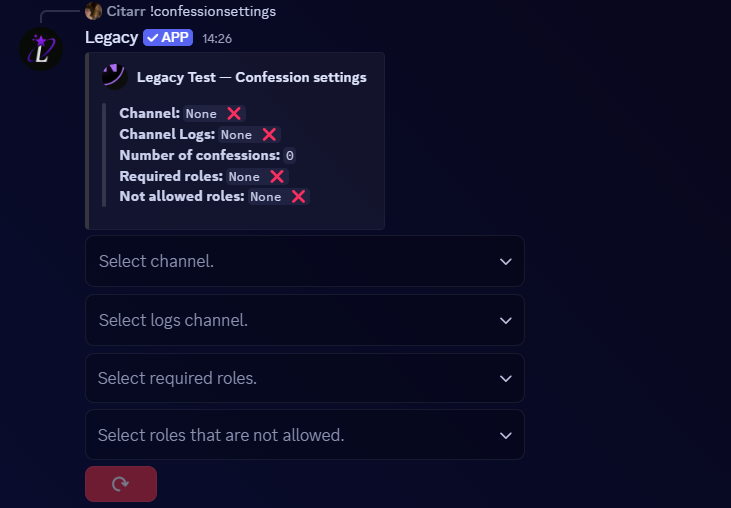

# Confession-settings

**Description:** This feature enables anonymous confessions on Discord. An administrator must first install it.

Our panel systems are designed for simplicity and ease of

<figure><figcaption></figcaption></figure>

## ⚙️ Configuration Options

### 🔹 Button Function

* **Button 1**: It allows resetting the entire configuration

<figure><figcaption></figcaption></figure>


To reset the system, confessions need to be sent.


### 🔹 Select Menu Configuration

* "**Select channel**": Allows you to select a channel for sending confessions. An embed will then be sent so users can submit their confessions.

<figure><figcaption></figcaption></figure>

Once the channel is set, it will directly send the confession embed to the configured channel.

<figure><figcaption></figcaption></figure>


Attention! The button will change from embed to regular with each confession sent. This means if you delete the last one, you'll need to update the channel again.


<figure><figcaption></figcaption></figure>

* "**Select logs channel**": Allows selecting a channel for sending user logs from confessions to prevent abuse.

<figure><figcaption></figcaption></figure>

Once the channel is set up, user confession logs will be sent to the log channel you have configured.

<figure><figcaption></figcaption></figure>

* "**Select Required Roles**" : Allows you to configure a required role for sending confessions.

<figure><figcaption></figcaption></figure>

Once the required role is configured, it will be mandatory for sending confessions; otherwise, this error message will be sent to the user who does not have it.

<figure><figcaption></figcaption></figure>

* "**Select roles that are not allowed**" : This final select-menu allows you to configure a role that will not be permitted to send confessions (Example: <mark style="background-color:red;">**@blacklistrole**</mark>).

<figure><figcaption></figcaption></figure>

Therefore, if the user has the role you configured, it will be impossible for them to send a confession.

<figure><figcaption></figcaption></figure>
